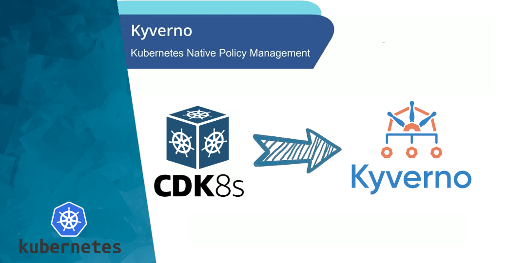

<p align="center">
  <a href="https://dev.to/vumdao">
    
  </a>
</p>
<h1 align="center">
  <div><b>Kyverno Policy As Code Using CDK8S</b></div>
</h1>

## Abstract
- [Kyverno](https://kyverno.io/) Kyverno is a policy engine designed for Kubernetes, Kyverno policies can validate, mutate, and generate Kubernetes resources plus ensure OCI image supply chain security.
- In this blog, it provides the way to create Kyverno policy as code using [CDK8S](https://cdk8s.io/) typescript.
- With importing Kyverno CRDs and using CDK8S you can create Kyverno policy manifest using your familiar programming languages such as typescript as scale.

## Table Of Contents
 * [Pre-requisite](#Pre-requisite)
 * [Overview of Kyverno](#Overview-of-Kyverno)
 * [Import Kyverno CRDs](#Import-Kyverno-CRDs)
 * [Write code](#Write-code)
 * [Build Kyverno policy from code](#Build-keda-scaledobjects-from-code)
 * [Apply and test](#Apply-and-test)
 * [Test Restart Deployment On Configmap Change](#Test-Restart-Deployment-On-Configmap-Change)
 * [Conclusion](#Conclusion)

---

## 🚀 **Pre-requisite** <a name="Pre-requisite"></a>
- Install typescript, node, and cdk8s as well as projen (optional) which is a tool of managing project configuration as code.
- [Getting started with cdk8s](https://cdk8s.io/docs/latest/getting-started/)
- EKS/kubernetes cluster to test

## 🚀 **Overview of Kyverno** <a name="Overview-of-Kyverno"></a>
- The features are
  - Policies as Kubernetes resources in YAML
  - Validate, mutate, or generate any resource using Kustomize overlays
  - Match resources using label selectors and wildcards
  - Block non-conformant resources using admission controls, or report policy violations
  - Test policies and validate resources using the Kyverno CLI, in your CI/CD pipeline, before applying them to your cluster

- How does it work?

  

## 🚀 **Import Kyverno CRDs** <a name="Import-Kyverno-CRDs"></a>
- Import kyverno CRDs as cdk8s lib
```
⚡ $ cdk8s import https://raw.githubusercontent.com/kyverno/kyverno/main/config/crds/kyverno.io_clusterpolicies.yaml --output src/imports/
Importing resources, this may take a few moments...
kyverno.io
  kyverno.io/clusterpolicy
```

- Output of importing
  ```
    ⚡ $ tree src/imports/
    src/imports/
    └── kyverno.io.ts

    0 directories, 1 file
  ```

## 🚀 **Write code** <a name="Write-code"></a>
- It's much more convinient to use visual code writing Kyverno policies in typescript language. We can read the document and find all references of construct, objects and properties of Kyverno policies through code descriptions.

- On top of all polices, there's simple construct (feel free to implement more the construct) so that each policy just need to input `name`, `pattern`, etc.
  - Interface of kyverno properties
    ```
    export interface KyvernoProps {
      name: string;
      message: string;
      namespace?: string;
      action?: ClusterPolicySpecValidationFailureAction;
      kinds?: Array<string>;
      resources?: {};
      exclude?: ClusterPolicySpecRulesExclude;
      deny?: ClusterPolicySpecRulesValidateDeny;
      pattern?: {};
      anyPatterns?: {};
    };
    ```
  - The construct class
    ```
    export class KyvernoClusterPolicy extends Chart {
      constructor(scope: Construct, name: string, kyvernoProps: KyvernoProps) {
        super(scope, name);

        new ClusterPolicy(this, `${kyvernoProps.name}`, {
          metadata: {
            name: kyvernoProps.name,
            namespace: kyvernoProps.namespace || undefined,
            annotations: {
              'policies.kyverno.io/category': 'Pod Security Standards',
            },
          },
          spec: {
            validationFailureAction: kyvernoProps.action || ClusterPolicySpecValidationFailureAction.ENFORCE,
            rules: [{
              name: kyvernoProps.name,
              match: {
                any: [{
                  resources: kyvernoProps.resources || { kinds: ['Pod'] },
                }],
              },
              validate: {
                deny: kyvernoProps.deny || undefined,
                message: kyvernoProps.message,
                pattern: kyvernoProps.pattern || undefined,
                anyPattern: kyvernoProps.anyPatterns || undefined,
              },
              exclude: kyvernoProps.exclude || undefined,
            }],
          },
        });
      }
    }
    ```

- This blog provides example of 5 usecases
  1. [Deny delete objects which have label `protected: 'true'`](https://github.com/vumdao/kyverno-policy-as-code-with-cdk8s/blob/master/src/kyverno-policies/deny-delete-resources.ts)
  2. [require-app-label](https://github.com/vumdao/kyverno-policy-as-code-with-cdk8s/blob/master/src/kyverno-policies/require-app-labels.ts)
  3. [require-request-limit](https://github.com/vumdao/kyverno-policy-as-code-with-cdk8s/blob/master/src/kyverno-policies/require-requests-limits.ts)
  4. [Require run-as-non-root](https://github.com/vumdao/kyverno-policy-as-code-with-cdk8s/blob/master/src/kyverno-policies/require-runasnonroot.ts)
  5. [Restart Deployment On Configmap Change]

## 🚀 **Build Kyverno policy from code** <a name="Build-Kyverno-policy-from-code"></a>
- Source code:
  ```
  ⚡ $ tree src/
  src/
  ├── imports
  │   └── kyverno.io.ts
  ├── kyverno-policies
  │   ├── deny-delete-resources.ts
  │   ├── kverno-list.ts
  │   ├── kyvernoProps.ts
  │   ├── require-app-labels.ts
  │   ├── require-requests-limits.ts
  │   └── require-runasnonroot.ts
  ├── main.ts
  └── test-yaml
      ├── inflate-negative-test-deployment.yaml
      └── inflate-positive-test-deployment.yaml

  3 directories, 10 files
  ```

- Build
  ```
  ⚡ $ npx projen build
  👾 build » default | ts-node --project tsconfig.dev.json .projenrc.ts
  👾 build » compile | tsc --build
  👾 build » post-compile » synth | cdk8s synth
  No manifests synthesized
  👾 build » test | jest --passWithNoTests --all --updateSnapshot
  No tests found, exiting with code 0
  ----------|---------|----------|---------|---------|-------------------
  File      | % Stmts | % Branch | % Funcs | % Lines | Uncovered Line #s
  ----------|---------|----------|---------|---------|-------------------
  All files |       0 |        0 |       0 |       0 |
  ----------|---------|----------|---------|---------|-------------------
  👾 build » test » eslint | eslint --ext .ts,.tsx --fix --no-error-on-unmatched-pattern src test build-tools projenrc .projenrc.ts
  ```

- Output yaml files
  ```
  ⚡ $ tree dist/
  dist/
  └── kyverno
      ├── require-app-label-kyverno-policy.yaml
      ├── require-request-limit-kyverno-policy.yaml
      └── run-as-non-root-kyverno-policy.yaml

  1 directory, 3 files
  ```

## 🚀 **Apply and test** <a name="Apply-and-test"></a>
- Apply policies and check result
  ```
  ⚡ $ kubectl apply -f dist/kyverno/
  clusterpolicy.kyverno.io/require-app-label configured
  clusterpolicy.kyverno.io/require-request-limit configured
  clusterpolicy.kyverno.io/run-as-non-root configured
  ```

- Test negative, the deployment `inflate-negative-test-deployment.yaml` does not have resource limit and request and enable `runAsNonRoot`
  ```
  ⚡ $ kubectl apply -f src/test-yaml/inflate-negative-test-deployment.yaml
  Error from server: error when creating "src/test-yaml/inflate-negative-test-deployment.yaml": admission webhook "validate.kyverno.svc-fail" denied the request:

  policy Deployment/default/inflate-negative-test for resource violations:

  require-app-label: {}
  require-request-limit:
    autogen-require-request-limit: 'validation error: All containers must have CPU and
      memory resource requests and limits defined. rule autogen-require-request-limit
      failed at path /spec/template/spec/containers/0/resources/limits/'
  ```

- Test positive
  ```
  kubectl apply -f src/test-yaml/inflate-positive-test-deployment.yaml
  deployment.apps/inflate-positive-test created
  ```

- Test without non-root user enabled, because the validation failure action is `AUDIT` so the deployment is applied successfully
  ```
  ⚡ $ kubectl apply -f src/test-yaml/inflate-without-nonroot-test-deployment.yaml
  deployment.apps/inflate-without-nonroot-test created
  ```

- But let's view the policy violations
  ```
  ⚡ $ kubectl describe polr polr-ns-default | grep inflate -A15 -B10| grep "Result: \+fail" -B10
      Seconds:  1661326749
    Category:   Pod Security Standards
    Message:    validation error: Containers must be required to run as non-root users. This policy ensures runAsNonRoot is set to true. rule autogen-run-as-non-root[0] failed at path /spec/template/spec/securityContext/runAsNonRoot/ rule autogen-run-as-non-root[1] failed at path /spec/template/spec/containers/0/securityContext/
    Policy:     run-as-non-root
    Resources:
      API Version:  apps/v1
      Kind:         Deployment
      Name:         inflate-without-nonroot-test
      Namespace:    default
      UID:          b05068c1-425c-41f4-ae0f-c913100a1c9c
    Result:         fail
  ```

## 🚀 **Test Restart Deployment On Configmap Change** <a name="Test-Restart-Deployment-On-Configmap-Change"></a>
- Changing configmap require rollout restart of deployments which reference to that configmap. We can use kyverno to automate this for us.
- Create kyverno policy to watch a `Configmap` and if it changes will write an annotation to one or more target Deployments thus triggering a new rollout and thereby refreshing the referred `Configmap`
- First we need to grant additional privileges to the Kyverno ServiceAccount for updating `apps.deployments` resources through [`Aggregated ClusterRoles`](https://kubernetes.io/docs/reference/access-authn-authz/rbac/#aggregated-clusterroles)
  - Kyverno has clusterrole with `aggregationRule` which will combine all clusterrole with label `app: kyverno` into one in aggregation
    ```
    aggregationRule:
      clusterRoleSelectors:
      - matchLabels:
          app: kyverno
    ```

  - Create new kyverno clusterrole to inject to the main one [kyverno-clusterrole.ts]().

- Kyverno policy to Restart Deployment On Configmap Change: [restart-on-configmap-changes.ts]()

- Rebuild project to generate manifest yaml files. `npx projen build`
  ```
  ⚡ $ tree dist/
  dist/
  ├── kyverno
  │   ├── require-app-label-kyverno-policy.yaml
  │   ├── require-request-limit-kyverno-policy.yaml
  │   ├── restart-on-configmap-change-policy.yaml
  │   └── run-as-non-root-kyverno-policy.yaml
  └── role
      └── kyverno-create-deployments-clusterrole.yaml

  2 directories, 5 files
  ```

- Apply clusterrole and policy then test using `inflate-positive-test-deployment.yaml` and `inflate-test-configmap.yaml`
  ```
  ⚡ $ kv7 get cpol restart-on-configmap-change
  NAME                          BACKGROUND   ACTION    READY
  restart-on-configmap-change   true         audit     true

  ⚡ $ kv7 get deploy -l app=inflate-positive-test
  NAME                    READY   UP-TO-DATE   AVAILABLE   AGE
  inflate-positive-test   1/1     1            1           62m

  ⚡ $ kv7 get cm -l app=inflate-test-configmap
  NAME                     DATA   AGE
  inflate-test-configmap   2      64m
  ```

- We now update the configmap to see kyverno rollout restart the deployment
  ```
  ⚡ $ kv7 apply -f inflate-test-configmap.yaml
  configmap/inflate-test-configmap configured

  ~ $ kv7 get pod -l app=inflate-positive-test --watch
  NAME                                     READY   STATUS    RESTARTS   AGE
  inflate-positive-test-668477b686-cdggl   1/1     Running   0          3m3s
  inflate-positive-test-59bb77549c-lxcjx   0/1     Pending   0          0s
  inflate-positive-test-668477b686-cdggl   1/1     Terminating   0          3m9s
  inflate-positive-test-59bb77549c-lxcjx   0/1     Pending       0          0s
  inflate-positive-test-59bb77549c-lxcjx   0/1     ContainerCreating   0          0s
  inflate-positive-test-59bb77549c-lxcjx   1/1     Running             0          1s
  inflate-positive-test-668477b686-cdggl   1/1     Terminating         0          3m11s
  inflate-positive-test-668477b686-cdggl   1/1     Terminating         0          3m11s
  ```

- Reference: https://kyverno.io/policies/other/restart_deployment_on_secret_change/restart_deployment_on_secret_change/

## 🚀 Conclusion <a name="Conclusion"></a>
- Someone said `Kyverno policy as code` but the code in yaml language, it's not actual programming language.
- Using CDK8S to generate Kyverno policy help to leverage the strong programming skill of developer and structure project more efficiently.

---

<h3 align="center">
  <a href="https://dev.to/vumdao">:stars: Blog</a>
  <span> · </span>
  <a href="https://github.com/vumdao/kyverno-policy-as-code-with-cdk8s/">Github</a>
  <span> · </span>
  <a href="https://stackoverflow.com/users/11430272/vumdao">stackoverflow</a>
  <span> · </span>
  <a href="https://www.linkedin.com/in/vu-dao-9280ab43/">Linkedin</a>
  <span> · </span>
  <a href="https://www.linkedin.com/groups/12488649/">Group</a>
  <span> · </span>
  <a href="https://www.facebook.com/CloudOpz-104917804863956">Page</a>
  <span> · </span>
  <a href="https://twitter.com/VuDao81124667">Twitter :stars:</a>
</h3>
